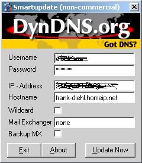



## DynDns Smartupdate

### Description

Update DynDns-Settings very easily :)

Please send me a eMail if you like this little (and fast) program.
 
### More Info
 
NOTHING!

ReturnCodes from DynDns.org

             |
---                |---
**Submitted On**   |2003-03-17 03:27:02
**By**             |[Frank Diehl](https://github.com/Planet-Source-Code/PSCIndex/blob/master/ByAuthor/frank-diehl.md)
**Level**          |Intermediate
**User Rating**    |4.8 (19 globes from 4 users)
**Compatibility**  |VB 6\.0
**Category**       |[Internet/ HTML](https://github.com/Planet-Source-Code/PSCIndex/blob/master/ByCategory/internet-html__1-34.md)
**World**          |[Visual Basic](https://github.com/Planet-Source-Code/PSCIndex/blob/master/ByWorld/visual-basic.md)
**Archive File**   |[DynDns\_Sma1560823172003\.zip](https://github.com/Planet-Source-Code/frank-diehl-dyndns-smartupdate__1-44069/archive/master.zip)

